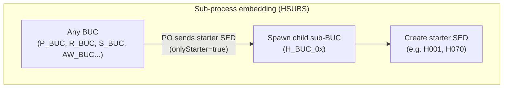
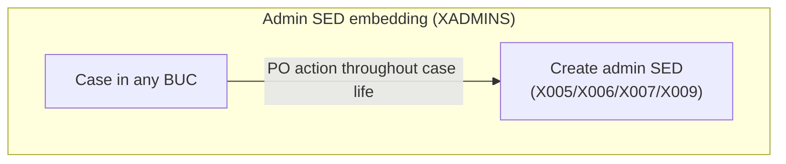
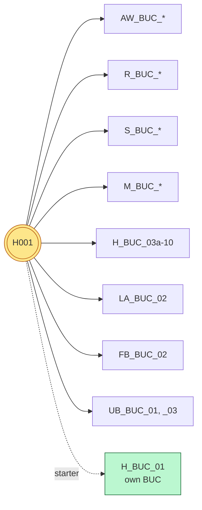
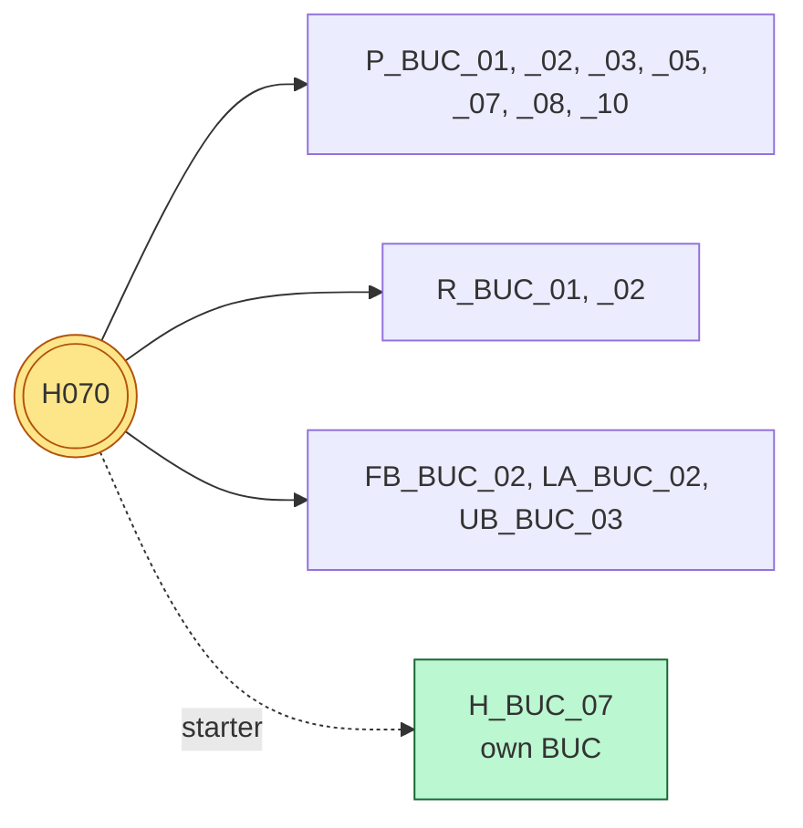
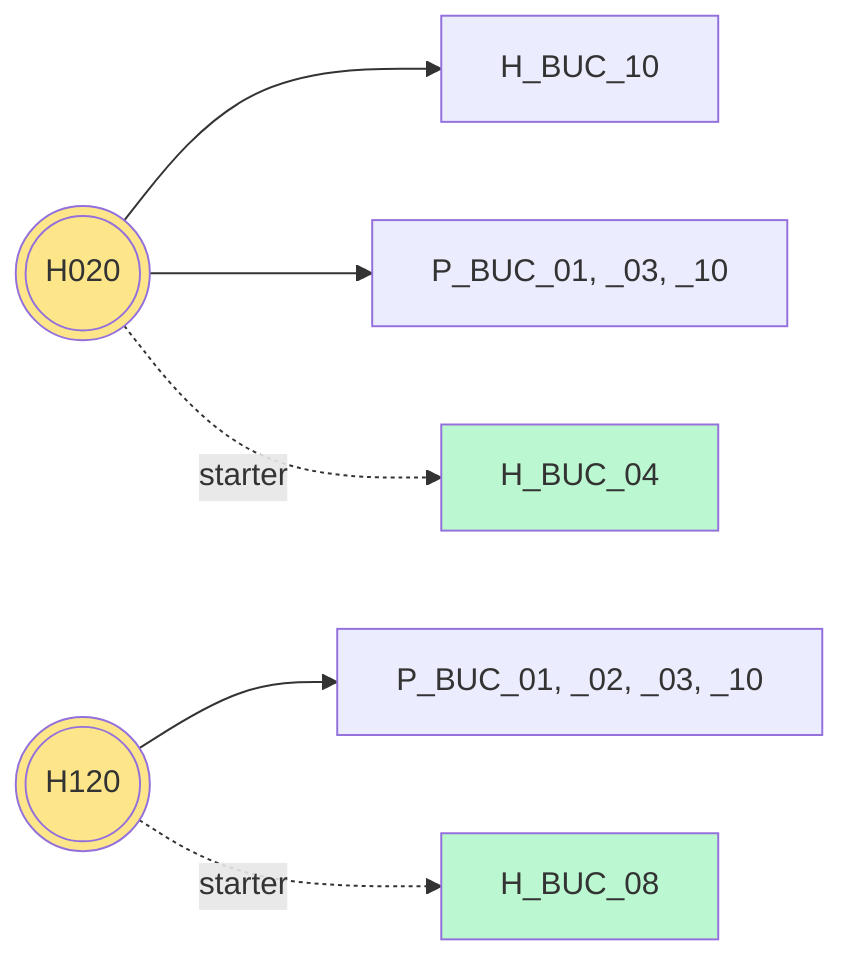
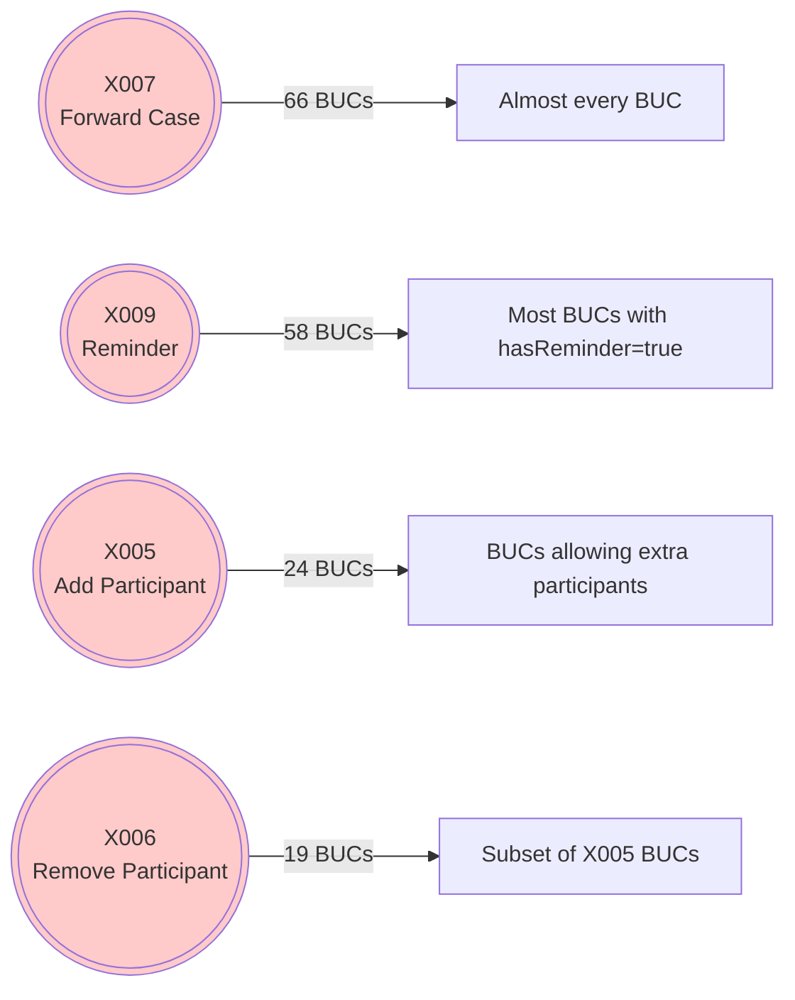
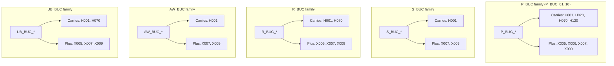
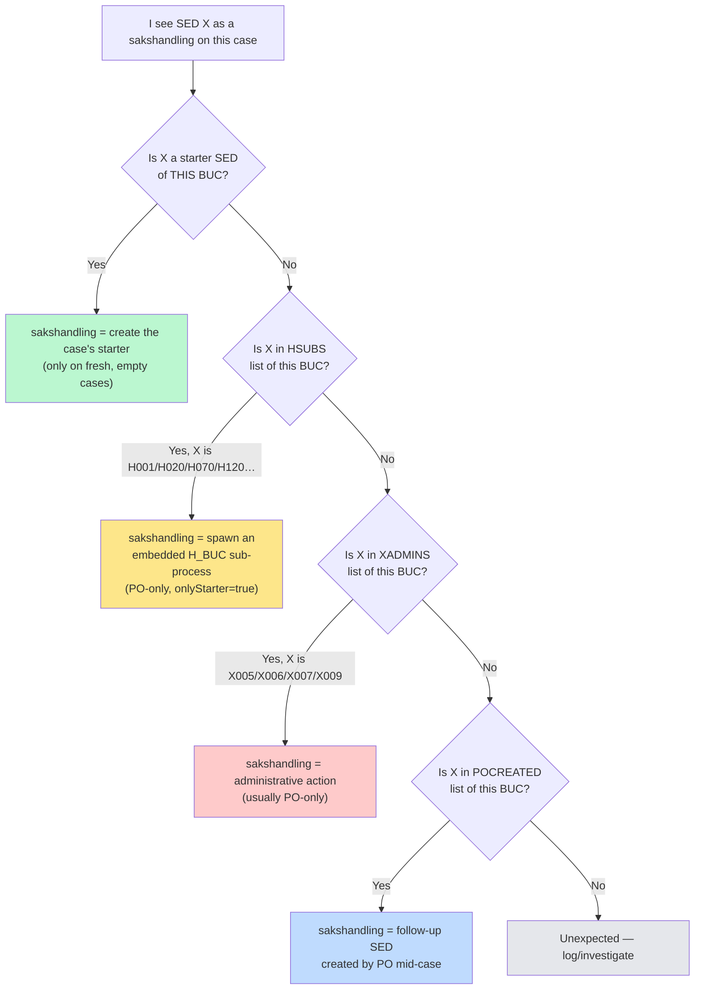

# SED Embedding Map (CDM 4.3)

How SEDs travel **across BUCs** as sub-processes (HSUBS) and admin actions (XADMINS).

---

## 1. The Two Mechanisms (Mermaid)





---

## 2. Cross-BUC Reach Heatmap

```
SED         Embedded in N BUCs    Bar (each █ = 1 BUC)
══════════════════════════════════════════════════════════════════
X007         66  ████████████████████████████████████████████████████████████████████
X009         58  ████████████████████████████████████████████████████████████
H001         50  ████████████████████████████████████████████████████
X005         24  ████████████████████████████
X006         19  ███████████████████████
H070         12  ████████████
H020          4  ████
H120          4  ████
H003-005      2  ██
H061          2  ██
H121          2  ██
H010          1  █
H011          1  █
H065          1  █
══════════════════════════════════════════════════════════════════
```

---

## 3. Where Each Cross-BUC SED Reaches (Mermaid)

### H001 — by far the most embedded SED (50 BUCs)



### H070 — death notification (12 BUCs, mostly pensions)



### H020 (notify changes) and H120 (reimbursement) — 4 BUCs each



### X-admin SEDs — universal



---

## 4. Big Picture: SED → BUC Family Reach (matrix)

Rows = embeddable SED. Columns = BUC family. Cell = number of BUCs in that family where this SED is embedded.

```
                    P    U    S    R    M    F    A   AW    H   total
H001 (info)         0    2    6    7    4    1    1   20    9      50
H070 (death)        7    1    0    2    0    1    1    0    0      12
H020 (changes)      3    0    0    0    0    0    0    0    1       4
H120 (reimb)        4    0    0    0    0    0    0    0    0       4
H003-005 (doc-req)  -    -    -    -    -    -    -    -    -       2
H061 (doc-check)    -    -    -    -    -    -    -    -    -       2
H121 (reimb-cont)   -    -    -    -    -    -    -    -    -       2
─────────────────────────────────────────────────────────────────────
X007 (forward)     ~10   4   ~24  7    4    3   ~5  ~24  ~10      66
X009 (reminder)    ~10   4   ~22  7    4    3   ~4  ~20   ~9      58
X005 (add part.)   varies                                          24
X006 (rem part.)   varies                                          19
```

---

## 5. Reverse View: What "carries" with each BUC family



---

## 6. Decision Tree — "Why did this SED appear as a sakshandling?"



---

_Source: parsed `HSUBS` and `XADMINS` declarations in `eessi-rina-buc/buc-process/4.3/*/src/main/resources/bucs/po_*.xml` from the RINA-6.3 source._
