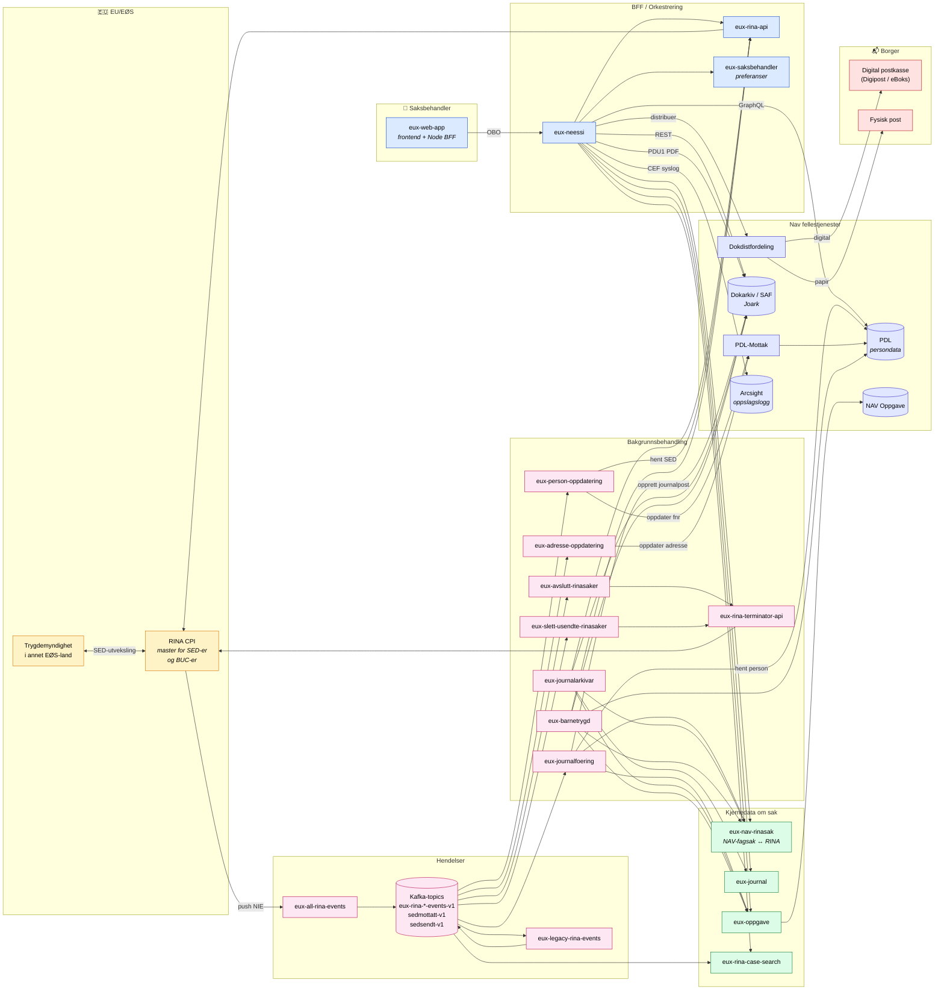
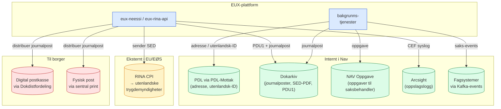

# E725.1 — Behandlingens livsløp i nEESSI / EUX

> Dette dokumentet beskriver hvordan personopplysninger flyter inn, gjennom og ut av EUX-plattformen (eessibasis). Det dekker alle ~24 EUX-applikasjonene, kildene de henter persondata fra, hvor opplysningene flyter underveis, og hvilke mottakere de sendes videre til – internt i Nav og til eksterne aktører i EU/EØS.

---

## 1. Oversikt

EUX/eessibasis er Nav sin plattform for **EESSI** – elektronisk utveksling av trygdeopplysninger med EU/EØS-land via **RINA** (Reference Implementation of a National Application). Personopplysninger behandles for å kunne:

1. Saksbehandle internasjonale trygdesaker for norske borgere og EØS-borgere med trygdetilknytning til Norge.
2. Utveksle SED-er (Structured Electronic Documents) mellom Nav og trygdemyndigheter i andre EU/EØS-land.
3. Holde Nav sine autoritative registre (PDL, Dokarkiv) oppdatert med data som mottas fra utlandet.
4. Produsere PDU1 (Portable Document U1, dagpengeperioder) til norske borgere.

**Kategorier av personopplysninger som behandles:**

| Kategori | Eksempler | Hvor lagres / passerer |
|---|---|---|
| Identitet | Fnr, D-nr, utenlandske ID-nummer, navn, fødselsdato, kjønn, statsborgerskap | RINA, PDL, Joark, EUX-databaser (metadata) |
| Kontakt og bosted | Adresse, land, periode, sivilstand, familierelasjoner | RINA, PDL, Joark |
| Trygd og økonomi | Trygdetidsperioder, ytelsestyper, beløp, arbeidsforhold, dagpengeperioder | RINA, Joark (SED-PDF), PDU1 |
| Helse (særlige kategorier) | Diagnoser, sykmeldingsperioder, vurderinger fra utenlandske leger (i medisinske SED-er, f.eks. S-SED, DA-SED, P-SED) | RINA (master), Joark (SED som PDF) |
| Familie | Ektefelle, barn, andre personer i samme sak (alle med fullt fnr/utenlandsk ID) | RINA, Joark |
| Saksmetadata | Saks-ID, BUC-type, status, hvilket Nav-kontor, tilknyttet saksbehandler | EUX-databaser, NAV Oppgave, NAV Fagsak |

---

## 2. Høynivå-livsløp

---

## 3. Innhenting — hvor opplysningene kommer fra

| Kilde | Hva hentes | Hvilken EUX-tjeneste henter | Hvordan |
|---|---|---|---|
| **RINA CPI** *(EU)* | SED-innhold (alle persondata i selve dokumentet), BUC-status, vedlegg | eux-rina-api (saksbehandlerflyt), eux-all-rina-events (push), eux-rina-terminator-api | REST over shared-secret JWT (eux-rina-api) eller service user / CAS (terminator, case-search) |
| **Trygdemyndighet i annet EØS-land** | SED-er om norske borgere og EØS-borgere med tilknytning til Norge | Indirekte via RINA CPI | – |
| **PDL** *(persondataløsning)* | Navn, adresse, sivilstand, foreldreansvar, adressebeskyttelse, dødsdato, statsborgerskap | eux-neessi, eux-journalfoering, eux-journal, eux-rina-api, eux-barnetrygd, eux-adresse-oppdatering, eux-person-oppdatering | GraphQL (Azure AD) |
| **SAF** | Eksisterende journalposter på fagsak | eux-neessi, eux-journalarkivar, eux-barnetrygd | GraphQL (Azure AD) |
| **NAV Oppgave** | Oppgaver tilknyttet bruker/sak | eux-oppgave, eux-journalfoering, eux-journalarkivar, eux-barnetrygd | REST (Azure AD) |
| **Innlogget saksbehandler** | Nav-ident, navn, enhet, roller (Entra ID-claims) | eux-web-app → eux-neessi (OBO) | Azure AD on-behalf-of |
| **Innbygger / annen sak** *(svært begrenset)* | Foreløpig fnr saksbehandler søker på | eux-web-app → eux-neessi → eux-rina-api → RINA | Saksbehandlerinitiert søk |

---

## 4. Behandling underveis — hva hver komponent gjør

### 4.1 Saksbehandlerflate

| Tjeneste | Personopplysninger | Lagring | Notat |
|---|---|---|---|
| **eux-web-app** | Viser SED, person, sak, journal til saksbehandler i nettleser | Ingen lagring (transient i nettleser-state) | Node BFF videresender med OBO-token til eux-neessi |
| **eux-neessi** | Orkestrerer alle saksbehandlerkall: henter persondata fra RINA, PDL, SAF, lager PDU1 (PDF) | Ingen DB; transient i minne under request | Skriver `AuditService` → Arcsight (CEF) ved hver visning |
| **eux-rina-api** | Proxyer SED-data mellom Nav og RINA CPI; rendrer SED-templates og genererer SED-PDF | Ingen DB; transient | Felles middleware – kalles fra alle Nav-systemer som trenger RINA-tilgang |
| **eux-saksbehandler** | Saksbehandler-preferanser (favorittenheter, sortering m.m.) – ingen borgerdata | PostgreSQL: kun saksbehandlerens egne preferanser (Nav-ident) | Lite personvernsensitiv – kun ansatte |

### 4.2 Kjernedata om saken

| Tjeneste | Personopplysninger | Lagring | Notat |
|---|---|---|---|
| **eux-nav-rinasak** | Lenke mellom NAV-fagsak (fnr) og RINA-saks-ID, BUC-type, status, journalstatus | PostgreSQL: fnr, RINA-saks-ID, fagsystem, opprettet-tid | Liten metadata-tabell – ingen SED-innhold |
| **eux-journal** | Journalpost-status (feilreg/ferdigstilling), saks-ID, journalpost-ID | PostgreSQL: journalpost-ID, status, sak-referanse | Holder ingen dokument-innhold |
| **eux-oppgave** | Oppgaver knyttet til borger/sak: fnr, oppgavetype, frist, tildelt enhet | PostgreSQL: oppgave-ID, fnr, status | Speiler oppgaver i felles NAV Oppgave |
| **eux-rina-case-search** | Søkeindeks: saks-ID, BUC, status, fnr, tidsstempler | PostgreSQL | Bygges fra Kafka-events; ikke SED-innhold |

### 4.3 Hendelses- og bakgrunnsbehandling

| Tjeneste | Personopplysninger | Lagring | Notat |
|---|---|---|---|
| **eux-all-rina-events** | NIE-events fra RINA: saks-ID, dokument-ID, BUC, eventtype | Ingen DB; publiserer rett til Kafka | Inneholder ikke SED-innhold, kun metadata |
| **eux-legacy-rina-events** | Som over, mappet til eldre Kafka-format (`sedmottatt-v1` / `sedsendt-v1`) | Ingen DB | Bro mellom nytt og eldre topic-format |
| **eux-journalfoering** | Henter SED fra eux-rina-api, slår opp person i PDL, oppretter journalpost i Dokarkiv, lager oppgave | Ingen DB; transient | Auto-journalføring på `sedmottatt-v1` / `sedsendt-v1` |
| **eux-journalarkivar** | Orkestrerer feilreg/ferdigstilling: leser fra SAF og eux-journal, oppdaterer Dokarkiv | Ingen DB | Trigget av NAIS-jobs; kaller mange tjenester |
| **eux-avslutt-rinasaker** | Saks-ID, BUC, sist endret, tilstand i state machine | PostgreSQL: saks-tilstander | Ingen SED-innhold |
| **eux-slett-usendte-rinasaker** | Saks-ID, BUC, status | PostgreSQL: saks-tilstander | Sletter RINA-saker som aldri fikk SED |
| **eux-rina-terminator-api** | Saks-ID som skal lukkes/slettes | Ingen DB; proxy til RINA CPI | Service user / CAS mot RINA |
| **eux-adresse-oppdatering** | Leser SED fra Kafka, ekstraherer adresseendring og fnr, sender til PDL-Mottak | Ingen DB; transient | **Maskinell flyt – ingen saksbehandler i konteksten, ingen Arcsight-logg** |
| **eux-person-oppdatering** | Leser SED, ekstraherer utenlandsk ID-nummer, henter full SED fra eux-rina-api, sender oppdatering til PDL-Mottak | PostgreSQL: oppdateringsstatus per (fnr, utenlandsk-ID) | **Maskinell flyt** |
| **eux-barnetrygd** | Årlig fornyelse: leser eksisterende saker, slår opp person i PDL, oppretter oppgaver, henter SED-er | Ingen DB; transient | Scheduled worker |
| **NAIS-jobs** *(eux-avslutt-rinasaker-naisjob, eux-journalarkivar-naisjob, eux-slett-usendte-rinasaker-naisjob)* | Ingen – kun cron-trigger som kaller REST-endepunkt | – | Inneholder ingen forretningslogikk eller persondata |

---

## 5. Videresending — hvor data går ut

| Mottaker | Hva sendes | Hvem sender | Rettslig grunnlag |
|---|---|---|---|
| **Trygdemyndigheter i EU/EØS** *(via RINA CPI)* | SED-er produsert av Nav-saksbehandler (innhold avhenger av BUC) | eux-rina-api på vegne av eux-neessi | Forordning (EF) 883/2004 og 987/2009 |
| **PDL** *(via PDL-Mottak)* | Adresseoppdatering, utenlandsk ID-nummer | eux-adresse-oppdatering, eux-person-oppdatering | Folkeregisterloven § 5-1, § 8-1 |
| **Dokarkiv (Joark)** | SED som PDF, PDU1 som PDF, metadata (fnr, fagsak, tema) | eux-neessi, eux-journalfoering, eux-journalarkivar, eux-barnetrygd | Arkivloven, fvl § 11 d |
| **NAV Oppgave** | Oppgavedata: fnr, oppgavetype, frist, tildelt enhet | eux-oppgave (på vegne av andre tjenester) | Internt verktøy |
| **Arcsight** *(oppslagslogg)* | Saksbehandlers Nav-ident + fnr + tidsstempel + meldingstekst | eux-neessi (CEF over TCP syslog til `audit.nais:6514`) | Personvernforordningen art. 30 / sikring av etterprøvbarhet |
| **Borger** *(via Dokdistfordeling)* | PDU1 til digital postkasse eller papir; kanal styres av KRR | eux-neessi → Dokdistfordeling | Forordning (EF) 883/2004 art. 1 / dagpengeforskriften |
| **Fagsystemer (pensjon, sykepenger m.fl.)** *(via Kafka)* | Hendelser om mottatt/sendt SED på `sedmottatt-v1` / `sedsendt-v1` | eux-legacy-rina-events | Internt – hjemmel ligger hos mottakende fagsystem |

---

## 6. Lagring og avslutning

| Aspekt | Praksis |
|---|---|
| **Master for SED-innhold** | RINA CPI (EU-infrastruktur). EUX lagrer ikke SED-innhold i egne databaser. |
| **Master for vedtaks-/dokument-historikk** | Dokarkiv (Joark). PDU1 og journalførte SED-er ligger her med Nav sine arkivregler. |
| **Master for persondata** | PDL (Folkeregisteret). EUX leser; eux-adresse-oppdatering / eux-person-oppdatering skriver via PDL-Mottak. |
| **EUX-egne databaser** | Inneholder kun *metadata* og *prosesstilstand* (saks-ID, BUC, status, koblinger). Ikke SED-innhold, ikke vedtakstekster. Lagringstid arves fra Nav sin felles sikkerhetspolicy og styres av flyway-migrert datamodell. |
| **Sletting av sak** | eux-rina-terminator-api (kalt fra eux-avslutt-rinasaker / eux-slett-usendte-rinasaker) lukker / arkiverer / sletter sak i RINA. Tilhørende rader i EUX-databasene fjernes / markeres avsluttet. |
| **Logging** | Team-logs (NAIS) med kort retention; `AuditService` skriver til Arcsight med separat retention forvaltet av Team Auditlogging. |

---

## 7. Spesielt om særlige kategorier (helse)

Helseopplysninger kan opptre i følgende SED-er som passerer EUX:

- **S-SED-er** (Sickness): S040, S045, S050 m.fl. – sykmeldinger, diagnoser, vurderinger fra utenlandsk lege.
- **DA-SED-er** (Accidents at Work / Occupational Diseases): DA002, DA005 – yrkesskade og yrkessykdom.
- **P-SED-er** (Pensions): P-SED-er som inneholder uføregrad og medisinske vurderinger ved uførepensjon.
- **H-SED-er** (Horizontal): H120 m.fl. som kan inneholde sensitiv informasjon i fritekstfelter.

Behandling av disse:

- **Master**: RINA CPI; passerer eux-rina-api transient.
- **Lagring i Nav**: Kun i Dokarkiv/Joark som journalført SED-PDF.
- **Tilgang**: Rollebasert via Azure AD-grupper og BUC-rolle. Adressebeskyttelse (`0000-GA-Fortrolig_Adresse` / `Strengt_Fortrolig_Adresse`) håndheves i RINA og Joark.
- **Logging**: Hver visning logges til Arcsight (jf. K253.1).

---

## 8. Avgrensninger

- EUX **fatter ingen vedtak**. Vedtak om norske ytelser fattes i fagsystemene (Pesys, Arena, K9, m.fl.).
- EUX **kommuniserer ikke direkte med innbygger** annet enn via PDU1 → Dokdistfordeling (felles distribusjonsløsning).
- EUX **eksponerer ingen innbyggerflate**. All saksbehandlerflate er bak Azure AD med MFA og godkjent enhet.
- **eux-rina-api** og **eux-adresse-oppdatering** har ingen direkte innbyggerinteraksjon; eux-rina-api er ren middleware, eux-adresse-oppdatering er Kafka-konsument.

---

## 9. Relaterte etterlevelseskrav

| Krav | Hva det dekker | Status |
|---|---|---|
| K253.1 | Oppslagslogg til Arcsight | Oppfylt (eux-neessi `AuditService`) |
| K255.1 | Adressebeskyttelse | Oppfylt (delvis – RINA + PDL + Joark) |
| K218.1 | Autentisering saksbehandler | Oppfylt (Entra ID + MFA) |
| K193.1 | Kommunikasjon via prefererte kanal | Oppfylt (Dokdistfordeling for PDU1) |
| K203.1 / K206.1 / K208.1 | Vedtak / forhåndsvarsel / varsler | Ikke relevant (EUX fatter ikke vedtak) |
| K154.1 | Taushetsplikt | Oppfylt via tilgangskontroll og Arcsight |
| K130.2 | Lagring i Norge | Oppfylt (NAIS GCP europe-north1) |
